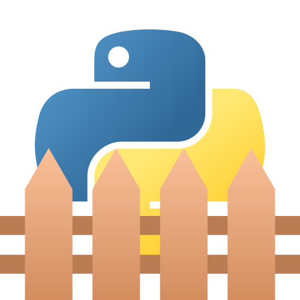

# Variables, scopes et closures en Python

_Comprendre leur fonctionnement et en éviter les pièges._

Le tutoriel est publié sur Zeste de Savoir à l'adresse suivante : https://zestedesavoir.com/tutoriels/3163/variables-scopes-et-closures-en-python/

Ou directement consultable depuis Github en parcourant le dossier [`src/`](src/).

Tutoriel sous licence [CC BY](https://creativecommons.org/licenses/by/4.0/deed.fr).
